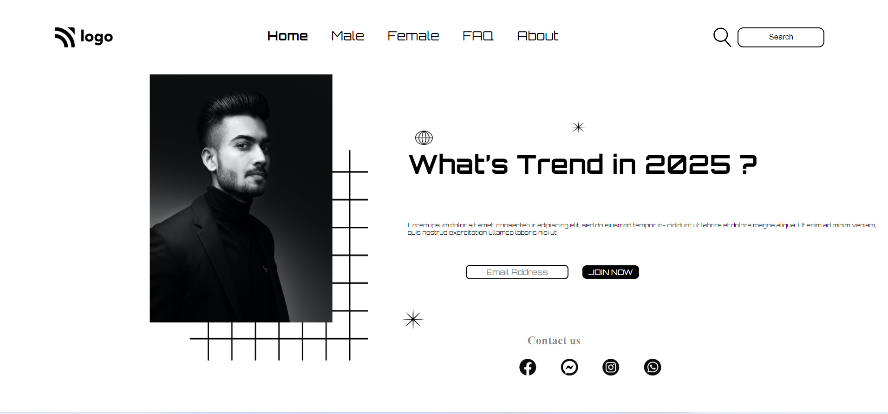

# Restaurant Website  

## 🛠 Technologies Used
  - HTML 
  - CSS
  

## Preview

[See](https://github.com/Shyam-Pandey/Project_1/commit/20530ddf38b632a00e5c465642784bf85d3170c9)

## Live Link
[Link](https://whatstrends.netlify.app)

## Author and Contact
- [Shyam Pandey](https://www.github.com/octokatherine)
    - [Coder Community](https://web.codercommunity.io/user/62d568cb998d86c8883a2766?tab=posts)

## Features
- It is single page Website with full responsiveness.

## Learning during project creation.
1. I have learned a lot during creation of project
2. How to create navbar and and make responsive website.
